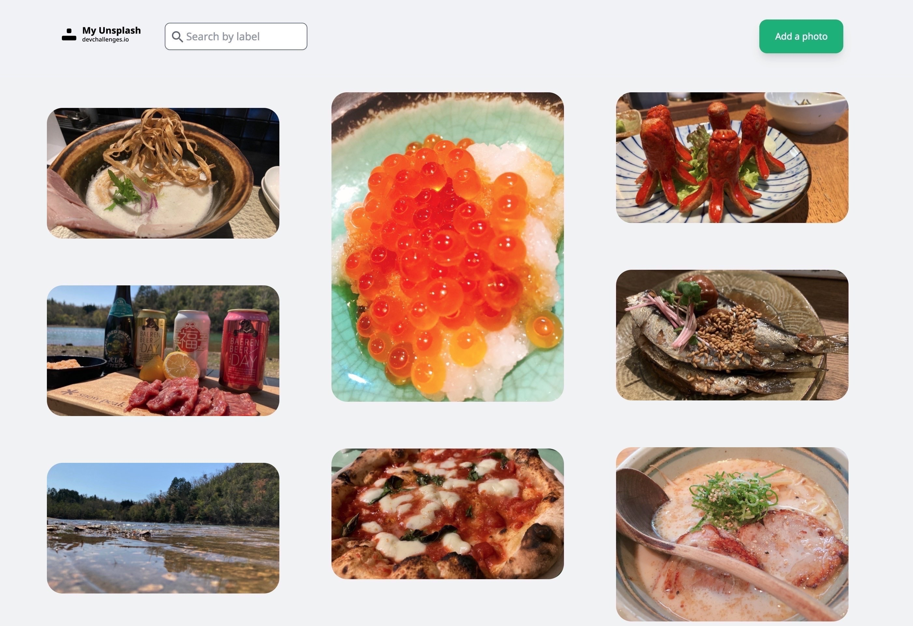

<!-- Please update value in the {}  -->

<h1 align="center">My Unsplash</h1>

<div align="center">
   Solution for a challenge from  <a href="http://devchallenges.io" target="_blank">Devchallenges.io</a>.
</div>

<div align="center">
  <h3>
    <a href="https://my-unsplash-tau.vercel.app/">
      Demo
    </a>
    <span> | </span>
    <a href="https://devchallenges.io/challenges/rYyhwJAxMfES5jNQ9YsP">
      Challenge
    </a>
  </h3>
</div>

<!-- TABLE OF CONTENTS -->

## Table of Contents

- [Overview](#overview)
  - [Built With](#built-with)
- [Features](#features)
- [How to use](#how-to-use)
- [Contact](#contact)
- [Acknowledgements](#acknowledgements)

<!-- OVERVIEW -->

## Overview



Developed with NextJS + NestJS.<br/>
We used nextjs for the frontend and nestjs for the backend.<br/>
The backend recorded label and URL in postgres.<br/>
For the backend, I used the one from Image-uploader-master.<br/>
(https://github.com/masa-fullstack/image-uploader-master)<br/>
<br/>
For the NextJS template, I used the NextJS Typescript Boilerplate from the official examples.<br/>
<br/>
For CSS, I used Tailwindcss.<br/>
During development, I used docker-compose to build the development environment.<br/>

Thanks for viewing :)

### Built With

<!-- This section should list any major frameworks that you built your project using. Here are a few examples.-->

- [NextJS](https://nextjs.org/)
- [NextJS Typescript Boilerplate](https://github.com/vercel/next.js/tree/master/examples/with-typescript-eslint-jest)
- [React Hook Form](https://react-hook-form.com/)
- [React Modal](https://github.com/reactjs/react-modal)
- [react-modal-hook](https://github.com/mpontus/react-modal-hook)
- [NestJS](https://nestjs.com/)
- [TypeScript](https://www.typescriptlang.org/)
- [Tailwindcss](https://tailwindcss.com/)
- [Docker](https://www.docker.com/)

## Features

<!-- List the features of your application or follow the template. Don't share the figma file here :) -->

This application/site was created as a submission to a [DevChallenges](https://devchallenges.io/challenges) challenge. The [challenge](https://devchallenges.io/challenges/3JFYedSOZqAxYuOCNmYD) was to build an application to complete the given user stories.

## How To Use

To clone and run this application, you'll need [Git](https://git-scm.com) and [Node.js](https://nodejs.org/en/download/) (which comes with [npm](http://npmjs.com)) and [Docker](https://www.docker.com/) installed on your computer. From your command line:

```bash
# Clone this repository
$ git clone https://github.com/masa-fullstack/my-unsplash

# Change directory
$ cd my-unsplash

```

Then, you update "./app/.env.development.template" and rename ".env.development.local".

```bash

# Start Docker
$ docker-compose up

```

Finally, the server is listed on localhost:4001.

## Acknowledgements

<!-- This section should list any articles or add-ons/plugins that helps you to complete the project. This is optional but it will help you in the future. For example: -->

- [Tailwind CHEAT SHEET](https://nerdcave.com/tailwind-cheat-sheet)

## Contact

- GitHub [@masa-fullstack](https://github.com/masa-fullstack)
- Twitter [@masa_fullstack](https://twitter.com/masa_fullstack)
